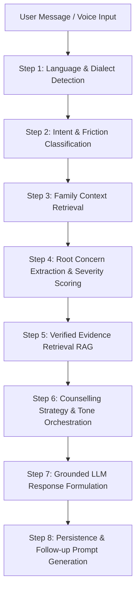

# SkillSathi AI Counselling Architecture & Anti-Hallucination Guardrails
**Smart India Hackathon 2026 | Problem Statement 26241**

---

## 1. Principles of Vocational AI Guidance

SkillSathi's AI engine is engineered as a **specialized, grounded vocational counsellor**, not a generic chatbot.

### Core Safeguards:
1. **Zero Statistical Fabrication**: The AI cannot invent placement rates, starting wages, training durations, or admission rules.
2. **Missing Evidence Transparency**: When official survey data is unavailable for a requested district or trade, the AI explicitly states: *"Verified government tracer information for this specific trade or location is currently unavailable"*, and directs the family to verified neighboring benchmarks or a human counsellor.
3. **No Invalidation of Family Roles**: The AI never labels parents as "wrong" or learners as "rebellious". It translates parental anxiety into grounded facts (e.g. PF/ESI contract coverage, lateral B.Tech eligibility).

---

## 2. 8-Step Dialogue Processing Pipeline

### Pipeline Details:
- **Language Detection**: Identifies English (`en`), Telugu (`te`), Hinglish, or Telenglish dialects.
- **Intent Classifier**: Maps utterances to `INCOME`, `JOB_SECURITY`, `FURTHER_EDUCATION`, `CAREER_GROWTH`, `SOCIAL_STATUS`, `WORKPLACE_SAFETY`, `LOCATION_MOBILITY`, or `COUNSELLOR_REQUEST`.
- **Context Injection**: Loads learner interests, parent priorities, household district, and active NSQF trade.
- **Evidence Retrieval**: Performs a database lookup for verified tracer data matching `(trade_id, district/state)`.
- **Strict Grounding Prompt**: Passes only verified database rows as allowable facts.

---

## 3. Provider Abstraction

SkillSathi supports multiple backends via the `AIProvider` abstract base class:
- **`MockAIProvider`**: Deterministic, zero-network, ultra-fast test provider enforcing identical anti-hallucination outputs.
- **`GeminiAIProvider`**: Google Gemini 1.5 Flash with structured system prompting and grounding rules.
- **`OpenAIProvider`**: GPT-4o-mini / GPT-4o.
- **`OllamaProvider`**: On-premise air-gapped LLM execution (e.g. LLaMA-3 or Mistral).

All API keys remain strictly server-side in backend environment variables (`GEMINI_API_KEY`, etc.) and are never exposed to the frontend.
