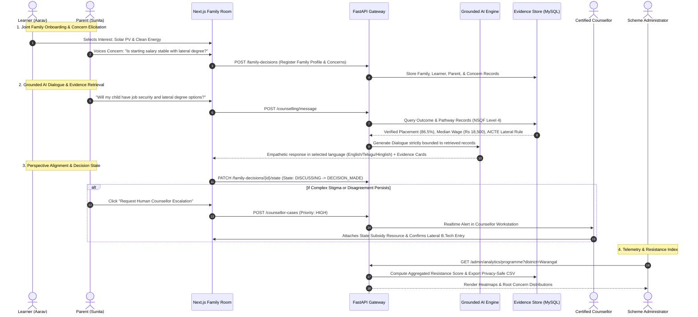

# SkillSathi Architecture & System Design
**Smart India Hackathon 2026 | Problem Statement 26241**  
*AI-Enabled Career Counselling and Family Decision-Support Platform for Vocational Education*  
**Tagline:** *"Explore a future your whole family believes in."*

---

## 1. System Overview & Vision

SkillSathi fundamentally shifts vocational education guidance from an isolated student assessment into a **Joint Family Decision Room**. Vocational education uptake in India faces severe social stigma, parental concerns around job security, salary floors, and fears of dead-end careers.

SkillSathi resolves this generational friction through:
1. **Source-Grounded Evidence Engine**: Retrieves official government tracer statistics (NCVET, DGT, Labour Bureau, AICTE) with full provenance.
2. **Joint Family Decision Room**: Real-time perspective alignment matching learner ambitions with parent security priorities.
3. **Regional Voice & Dialect AI**: Natural multilingual guidance in English, Telugu, and Hinglish.
4. **Human Counsellor Escalation Ecosystem**: Integrated workflow for edge cases, subsidy guidance, and case notes.
5. **Scheme Administrator Resistance Telemetry**: District and trade-level friction analytics mapping exactly *where* and *why* families hesitate.

---

## 2. High-Level System Architecture

```
                          +------------------------------------------+
                          |        Client Layer (Web & Mobile)       |
                          |  - Family Decision Room (Learner/Parent) |
                          |  - Certified Counsellor Workstation      |
                          |  - Scheme Administrator Analytics        |
                          +--------------------+---------------------+
                                               | HTTPS / WSS
                                               v
                          +------------------------------------------+
                          |     FastAPI Application Gateway Core     |
                          |  - Rate Limiting & Input Validation      |
                          |  - JWT Authentication & RBAC Isolation   |
                          |  - WebSocket Live Counselling Hub        |
                          +--------------------+---------------------+
                                               |
         +-------------------------------------+-------------------------------------+
         |                                     |                                     |
         v                                     v                                     v
+-----------------------+            +-----------------------+            +-----------------------+
|  AI Counselling Engine|            | Business Service Core |            | Data Ingestion Engine |
| - Language Detector   |            | - Family Decision Svc |            | - Source Adapters     |
| - Intent & Concern RAG|            | - Counsellor Case Svc |            | - Deduplication Pipe  |
| - Strict Grounding    |            | - Resistance Engine   |            | - Validator & Audit   |
| - LLM Provider Factory|            | - Provenance Service  |            | - Sync Coordinator    |
+-----------+-----------+            +-----------+-----------+            +-----------+-----------+
            |                                    |                                    |
            +------------------------------------+------------------------------------+
                                                 |
                                                 v
                                  +------------------------------+
                                  |    Persistence Layer (DB)    |
                                  | MySQL 8.0+ / SQLite Test DB  |
                                  | 18 Normalized Entity Tables  |
                                  +------------------------------+
```

---

## 3. Technology Stack

| Layer | Component | Version / Technology | Purpose |
| :--- | :--- | :--- | :--- |
| **Frontend** | Framework | Next.js 16.3.8 (App Router) & React 19 | SSR, Streaming, Responsive Touch-First UI |
| **Styling** | Design System | Future Garden CSS + Vanilla Tailwind Tokenization | Warm Ivory, Deep Navy, Coral, Emerald Palette |
| **Motion** | Animation Engine | Framer Motion | Gestures, Drawer slide-outs, Alignment transitions |
| **Backend** | API Framework | FastAPI (Python 3.13) | Asynchronous, OpenAPI 3.1 typed endpoints |
| **ORM** | Persistence | SQLAlchemy 2.0+ & Alembic | Data mapping, session lifecycle, connection pooling |
| **Database** | Primary Store | MySQL 8.0+ (Production) / SQLite (Dev & Test) | ACID compliant relational storage |
| **AI / LLM** | Provider Abstraction | Google Gemini 1.5 Flash / OpenAI / Ollama / Mock | Anti-hallucination grounded dialogue |
| **Realtime** | WebSockets | Starlette WebSocket Endpoints | Instant multi-party family sync |

---

## 4. End-to-End User Flow


