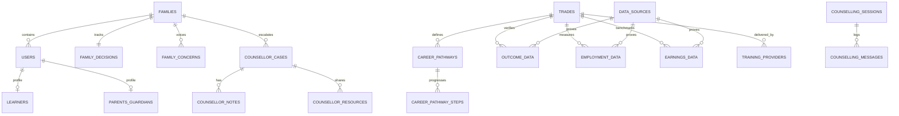

# SkillSathi Database Schema & Provenance Design
**Smart India Hackathon 2026 | Problem Statement 26241**

---

## 1. Relational Database Overview

The SkillSathi schema is structured in 3 core domains:
1. **Family & User Units**: Manages joint family memberships, learner profiles, parent priorities, and friction tickets.
2. **Vocational Intelligence & NSQF Pathways**: Stores trades, NSQF levels, step-by-step career progression ladders, and higher education lateral options.
3. **Verified Outcome & Provenance Evidence**: Stores tracer placement rates, median salary benchmarks, apprenticeship stipends, and source audit trails.

---

## 2. Entity Relationship Diagram (ERD)

---

## 3. Detailed Entity Dictionary

### Core Family & Session Tables
- **`families`**: `id`, `family_code` (unique, e.g. `SK-WARANGAL-71`), `family_name`, `state`, `district`, `pincode`, `household_income_bracket`, `preferred_language`, `alignment_score`, `created_at`, `updated_at`.
- **`users`**: `id`, `family_id` (FK), `role` (`LEARNER`, `PARENT`, `COUNSELLOR`, `ADMIN`), `full_name`, `email`, `phone_number`, `password_hash`, `is_active`, `is_demo`.
- **`learners`**: `id`, `user_id` (FK), `family_id` (FK), `current_education_grade`, `interest_areas` (JSON array), `expected_salary_monthly_inr`, `further_education_goals` (`POLYTECHNIC_DIPLOMA`, `LATERAL_DEGREE`, `IMMEDIATE_JOB`).
- **`parents_guardians`**: `id`, `user_id` (FK), `family_id` (FK), `relationship_type` (`FATHER`, `MOTHER`, `GUARDIAN`), `education_background`, `top_priorities` (JSON array), `raw_concerns_text`, `is_onboarding_complete`.
- **`family_concerns`**: `id`, `family_id` (FK), `user_id` (FK), `source_role`, `category` (`JOB_SECURITY`, `INCOME`, `FURTHER_EDUCATION`, `SOCIAL_STATUS`, `WORKPLACE_SAFETY`, `LOCATION_MOBILITY`), `concern_text`, `severity_level` (1-10), `is_addressed`.
- **`family_decisions`**: `id`, `family_id` (FK), `selected_trade_id` (FK), `decision_status` (`EXPLORING`, `DISCUSSING`, `DECISION_MADE`, `COUNSELLOR_ESCALATED`), `learner_agreed` (bool), `parent_agreed` (bool), `alignment_notes`.

### Vocational Intelligence Tables
- **`trades`**: `id`, `code` (e.g. `SOLAR-PV-401`), `title`, `sector`, `nsqf_level` (1-8), `duration_months`, `entry_qualification`, `overview`, `key_skills` (JSON array), `is_active`, `is_demo`.
- **`career_pathways`**: `id`, `trade_id` (FK), `title`, `entry_qualification`, `total_progression_years`, `is_demo`.
- **`career_pathway_steps`**: `id`, `pathway_id` (FK), `step_order` (1, 2, 3), `role_title`, `experience_required_months`, `expected_monthly_inr_min`, `expected_monthly_inr_max`, `education_ladder_option`.
- **`training_providers`**: `id`, `name`, `provider_type` (`GOVT_ITI`, `PRIVATE_ITI`, `NSTI`, `PRADHAN_MANTRI_KK`), `district`, `state`, `rating`, `has_hostel_facility`.

### Verified Evidence & Provenance Tables
- **`data_sources`**: `id`, `code` (`NCVET_NQR`, `DGT_TRACER_2024`, `LABOUR_BUREAU_WAGE`, `AICTE_LATERAL_DB`), `name`, `publisher_ministry`, `source_url`, `methodology_notes`, `freshness_status` (`LIVE`, `FRESH`, `STALE`, `DEMO`), `last_verified_at`.
- **`outcome_data`**: `id`, `trade_id` (FK), `data_source_id` (FK), `district`, `state`, `survey_year`, `sample_size`, `placement_rate` (%), `median_starting_monthly_inr`, `verified_status` (`VERIFIED`, `UNDER_REVIEW`, `DEMO_SIMULATED`), `is_demo`.
- **`employment_data`**: `id`, `trade_id` (FK), `formal_contract_rate` (%), `pf_esi_coverage_rate` (%), `one_year_retention_rate` (%), `top_hiring_companies` (JSON array).
- **`earnings_data`**: `id`, `trade_id` (FK), `entry_level_monthly_inr`, `mid_career_monthly_inr`, `naps_stipend_monthly_inr`.

### Counsellor & Telemetry Tables
- **`counsellor_cases`**: `id`, `family_id` (FK), `counsellor_id` (FK), `priority` (`HIGH`, `MEDIUM`), `case_status` (`OPEN`, `ASSIGNED`, `RESOLVED`), `escalation_reason`, `resolution_summary`.
- **`counsellor_notes`**: `id`, `case_id` (FK), `author_id` (FK), `note_text`, `visibility` (`FAMILY_SHARED`, `COUNSELLOR_PRIVATE`), `is_action_item`.
- **`counsellor_resources`**: `id`, `case_id` (FK), `resource_type` (`SCHEME`, `HOSTEL_ADMISSION`, `LATERAL_CIRCULAR`), `title`, `url`.
- **`counselling_messages`**: `id`, `session_id` (FK), `sender_role` (`LEARNER`, `PARENT`, `AI_COUNSELLOR`), `message_text`, `detected_concerns` (JSON array), `cited_evidence_ids` (JSON array).

---

## 4. Provenance & Anti-Hallucination Guarantees
Every factual metric displayed in the frontend or injected into the AI prompt requires non-null `data_source_id`, `survey_year`, `publisher_ministry`, and `source_url`. Any record where `is_demo=True` is forcibly tagged with `[DEMO DATA - Simulation]`.
